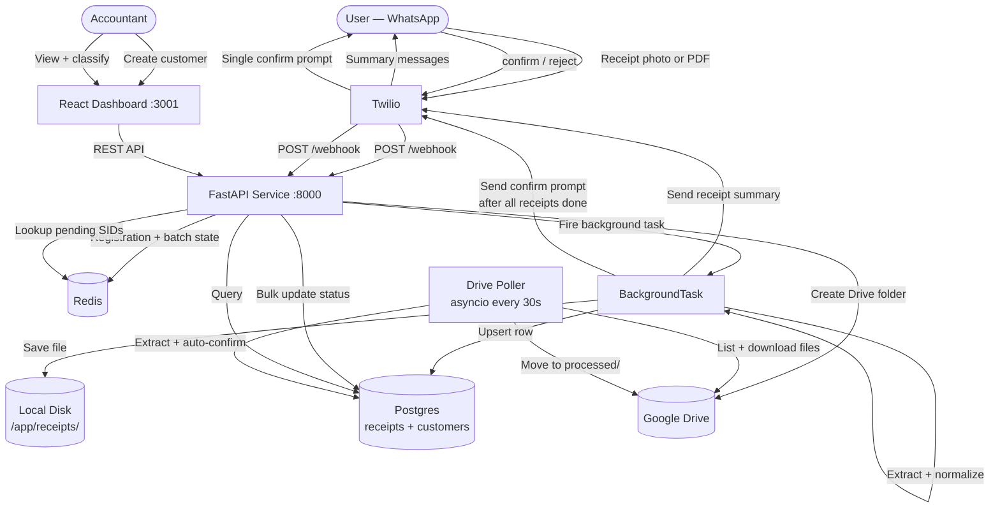
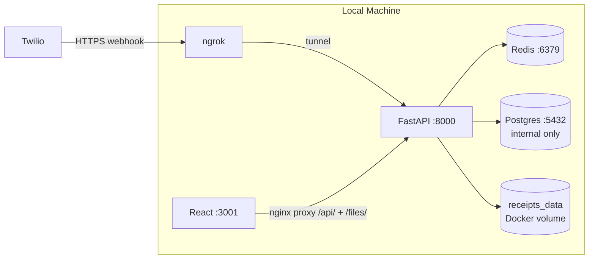
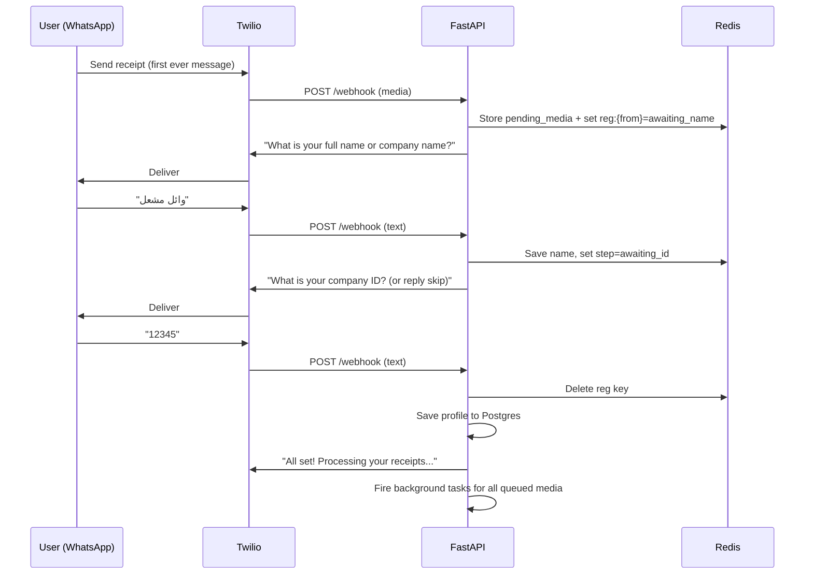
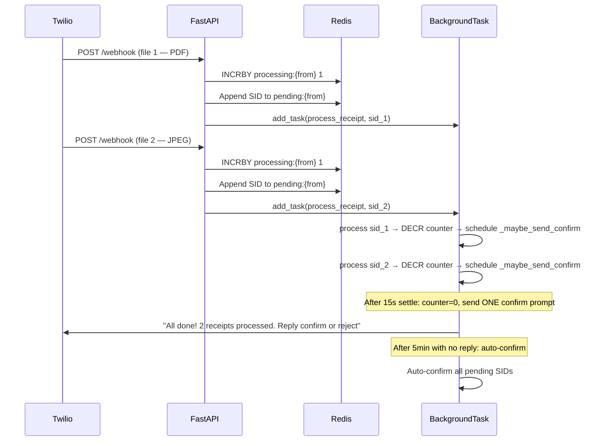
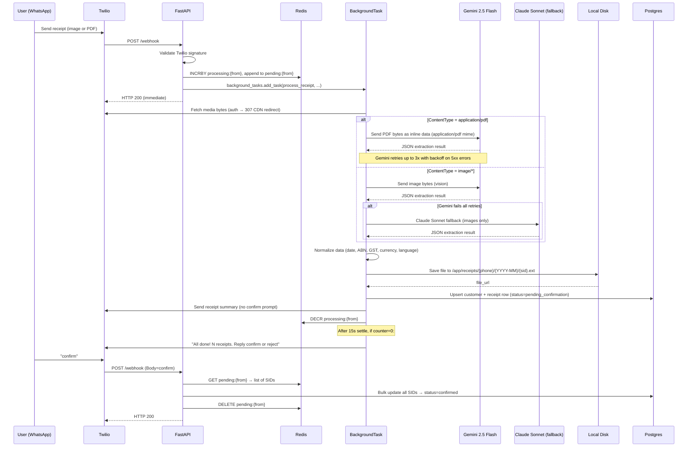
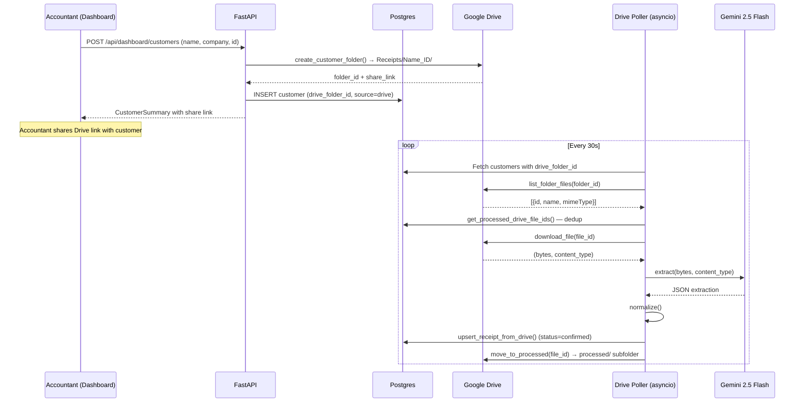
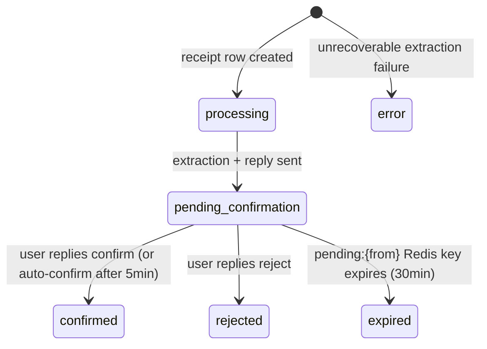
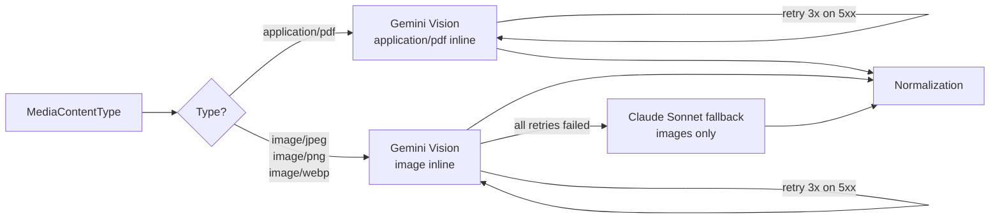

# Architecture Design

## Overview

Two receipt ingestion channels feed the same Postgres database and React dashboard:

1. **WhatsApp (Twilio)** — Event-driven pipeline triggered by an inbound WhatsApp message. A thin FastAPI service receives the webhook, fires a background task via `BackgroundTasks`, and returns HTTP 200 immediately. Redis manages state for registration, batch tracking, and confirmation.

2. **Google Drive** — Accountant creates a customer from the dashboard; the system auto-creates a Drive folder. An asyncio background poller runs every 30 seconds, picks up new files, extracts data, and auto-confirms receipts (no user reply needed).

Postgres stores all structured receipt data. A React dashboard allows the accountant to classify and review receipts from both channels per customer.

---

## System Context



---

## Local Development Stack



All services run via a single `docker compose up` — `api`, `redis`, `postgres`, `dashboard`. ngrok exposes `localhost:8000` to Twilio.

---

## Registration Flow

New users must register before receipts are processed. The state machine lives in Redis.



**Redis keys used:**
- `reg:<from_number>` — JSON `{step, name}` — 1h TTL
- `pending_media:<from_number>` — JSON list of queued files — 1h TTL

Files sent during registration are queued and processed after registration completes.

---

## Multi-File Batch Flow

Twilio sends each file attachment as a **separate webhook POST**. The system accumulates all SIDs and sends one confirmation prompt after all processing is done.



---

## End-to-End Receipt Processing Sequence



---

## Google Drive Ingestion Flow



**Key differences from WhatsApp:**
- No Twilio, no Redis counter, no confirmation step
- `status` is set directly to `confirmed`
- `drive_file_id` stored in DB for idempotency (poller deduplicates on each cycle)
- Multi-page PDFs split into individual pages, each stored as a separate receipt row
- Processed files moved to `processed/` subfolder in the customer's Drive folder

---

## Job State Machine



Status stored in `receipts.status` column. Redis `pending:<from_number>` holds the list of SIDs awaiting confirmation (30-minute TTL as safety net; actively deleted on confirm/reject).

---

## MIME-Type Routing



> **Note:** LlamaParse is present in `ocr.py` but is not used in the active pipeline — it consistently times out on the free tier. PDFs go directly to Gemini Vision which natively supports `application/pdf` as an inline data mime type.

---

## Data Schema

### Postgres Tables

#### `customers`

| Column | Type | Notes |
|---|---|---|
| `id` | Integer PK | Auto-increment |
| `phone_number` | String unique | WhatsApp number or `drive_{uuid}` placeholder for Drive-only customers |
| `display_name` | String nullable | Set during registration or via dashboard |
| `company_name` | String nullable | Set during registration or via dashboard |
| `company_id` | String nullable | Company registration number |
| `drive_folder_id` | String nullable | Google Drive folder ID for this customer |
| `source` | String | `whatsapp` \| `drive` \| `both` |
| `default_currency` | String | `ILS` or `USD` — always applied to receipts, overrides AI-extracted currency |
| `created_at` | DateTime | UTC |

#### `receipts`

| Column | Type | Notes |
|---|---|---|
| `id` | Integer PK | Auto-increment |
| `message_sid` | String unique | Twilio MessageSid — idempotency key |
| `customer_id` | FK → customers | |
| `phone_number` | String | Denormalized for fast lookup |
| `vendor` | String nullable | Normalized vendor name |
| `cost` | Float nullable | Total amount inc. tax |
| `tax` | Float nullable | GST/tax line amount |
| `currency` | String | ISO 4217 (AUD, ILS, USD, etc.) |
| `date` | String nullable | YYYY-MM-DD |
| `abn` | String nullable | 11-digit ABN, validated |
| `receipt_language` | String nullable | BCP 47 (e.g. `en`, `he`, `ar`) |
| `extraction_model` | String nullable | `gemini-2.5-flash` or `claude-sonnet-4-5` |
| `transaction_type` | String | `income` or `expense` — default `expense` |
| `status` | String | `processing`, `pending_confirmation`, `confirmed`, `rejected`, `error` |
| `file_url` | String nullable | `/files/{phone}/{YYYY-MM}/{sid}.ext` |
| `receipt_number` | String nullable | Invoice/receipt number extracted from document |
| `drive_file_id` | String nullable | Google Drive file ID — idempotency key for Drive receipts |
| `created_at` | DateTime | UTC |
| `updated_at` | DateTime | UTC, auto-updated |

### Redis Keys

| Key Pattern | Value | TTL |
|---|---|---|
| `reg:<from_number>` | JSON `{step, name}` — registration state machine | 1h |
| `pending_media:<from_number>` | JSON list of `{message_sid, media_url, content_type}` | 1h |
| `pending:<from_number>` | JSON list of SIDs awaiting confirmation | 30min |
| `processing:<from_number>` | Integer batch counter (decremented as jobs finish) | 30min |

### File Storage Layout

```
/app/receipts/                        ← Docker volume: receipts_data
└── {safe_phone}/                     ← phone without whatsapp: prefix and +
    └── {YYYY-MM}/
        └── {message_sid}.{ext}       ← ext: pdf, jpg, png, webp
```

Served by FastAPI `StaticFiles` at `/files/` — e.g. `http://localhost:8000/files/972524871170/2026-06/SM123.jpg`

---

## Dashboard API

| Method | Path | Description |
|---|---|---|
| `GET` | `/api/dashboard/customers` | All customers with receipt counts, income/expense totals, `drive_folder_id`, `source` |
| `POST` | `/api/dashboard/customers` | Create customer; auto-creates Drive folder if `GOOGLE_DRIVE_FOLDER_ID` set |
| `GET` | `/api/dashboard/customers/{id}/receipts` | All receipts for a customer |
| `PATCH` | `/api/dashboard/receipts/{id}` | Update any receipt fields (vendor, cost, tax, currency, date, abn, receipt_number, type, status) |
| `DELETE` | `/api/dashboard/receipts/{id}` | Delete receipt — removes DB row, GCS file, and moves Drive file to `deleted/` subfolder |
| `PATCH` | `/api/dashboard/customers/{id}/profile` | Update display_name, company_name, company_id, phone_number, default_currency |
| `PATCH` | `/api/dashboard/customers/{id}/name` | Update display name only (legacy) |

Dashboard served at http://localhost:3001. The nginx container proxies `/api/` and `/files/` → `http://api:8000`.

---

## Multilanguage Support

Receipts may be in any language. Confirmed working: Hebrew (ILS receipts from Israel).

| Script | Examples | Handled by |
|---|---|---|
| Latin | English, French, Spanish | Gemini Vision |
| Arabic / Hebrew (RTL) | Arabic, Hebrew | Gemini Vision |
| CJK | Chinese, Japanese, Korean | Gemini Vision |

Gemini detects the language, returns a BCP 47 code, and normalizes all values to English/ISO formats.

---

## Normalization Rules

### Date
- Accept any format (DD/MM/YYYY, ISO 8601, "Jan 3 2024", etc.)
- Output: `YYYY-MM-DD` via `python-dateutil`
- On parse failure: store raw string

### ABN (Australian Business Number)
- Strip all non-digit characters
- Must be exactly 11 digits
- Validate using ATO checksum (weights: 10,1,3,5,7,9,11,13,15,17,19)

### GST Logic (Australian)

| Scenario | Rule |
|---|---|
| Tax line present on receipt | Use extracted value directly |
| "GST included" but no tax line | `tax = round(cost / 11, 2)` |
| No tax info found | `tax = None` |

### Currency
- Always use the customer's `default_currency` — AI-extracted currency is ignored
- Customer default is set at creation (`ILS` or `USD`) and editable from the dashboard

---

## Error Handling

| Failure | Behaviour |
|---|---|
| Gemini 5xx / rate limit | Retry up to 3x with 3s, 6s backoff |
| Gemini JSON invalid | Skip to Claude fallback (images only) |
| Claude also fails | `status = error`, send error WhatsApp message |
| File save fails | Non-fatal — `file_url` stored as `None`, processing continues |
| Postgres write fails | Error logged, user receives error WhatsApp message |
| User never confirms | Auto-confirm after 5 minutes; `pending:{from}` Redis key also expires after 30min |
| LlamaParse timeout | Not used in active pipeline; code present but bypassed |

---

## Security

| Concern | Mitigation |
|---|---|
| Webhook spoofing | Validate `X-Twilio-Signature` on every inbound POST (skipped in `development` env) |
| Sensitive receipt data | All processing runs locally in Docker; files stored on local volume |
| LLM prompt injection | OCR text treated as data in user turn; system prompt is instruction-only |
| API keys | Loaded from `.env`, never hardcoded; `.env` in `.gitignore` |
| Google credentials | Service account JSON mounted as Docker secret at `/secrets/credentials.json` |
| CORS | FastAPI CORS middleware: only ports 3000 and 3001 allowed |
